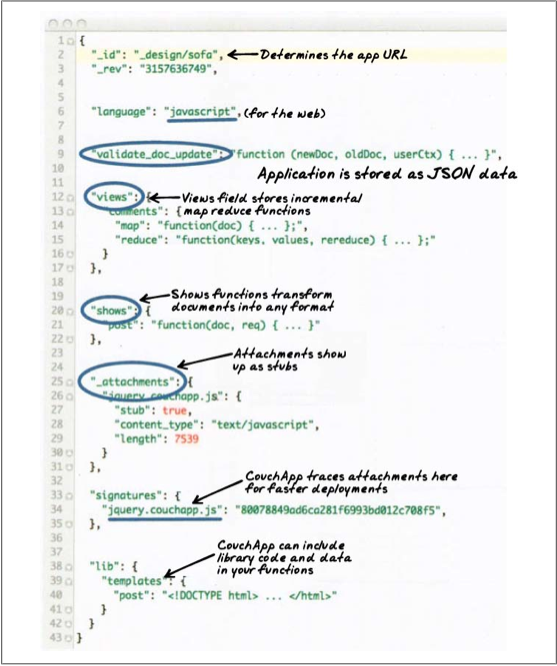

!SLIDE subsection transition=fade

# Design Documents #

!SLIDE bullets incremental

# Design Documents #

* special type of document that contains application code
* id begins with _design/
* just like any other document (replicate, rev)
* where CouchDB looks for views and other application functions

!SLIDE center
## Design Documents ##

!SLIDE smaller

# Design Documents #

	@@@ javaScript
		{
			"_id" : "_design/example",
			"views" : {
				"foo" : {
					"map" : "function(doc){ emit(doc._id, doc._rev)}"
				}
			}
		}

!SLIDE commandline incremental smaller

# Design Documents #

	$ curl -X PUT http://127.0.0.1:5984/basic/_design/example -d @mydesign.json

	{"ok":true,"id":"_design/example","rev":"1-230141dfa7e07c3dbfef0789bf11773a"}

	curl http://127.0.0.1:5984/basic/_design/example/_view/foo